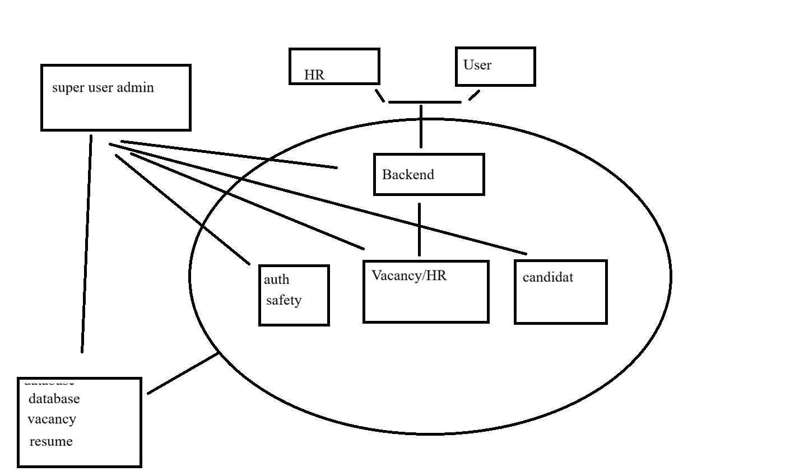

Сайт для поиска работы, нормалный аналог __hh.ru__. В данном сервисе будут отсутсвовать боты и нейронки. Будет запрет для размещения вакансий ~~яндекса~~.
Будет состаять из серверной(backend) части, клиента для __hr__ менеджера, клиента для соискателя, Админки для проведения орм.


# Backend

1. Регистрация аккаунта/авторизация
* Зарегистрировать акк
* Удалить акк
* Не дать зарегать один акк два раза от одного клиента
* Проверка/создание пароля
* Прохождение капчи
* Подтверждение на почту
2. Удаление вакансии или резюме с аккаунтом
3. Создание вакансии или резюме
4. Показ доступных вакансий и кандидатов
5. Поиск вакансий и кандидатов
``Поиск должен быть через запрос по названию вакансии или специализации кандидата,
сделать возможность выбирать параметры``
6. Фильтрация вакансий
``Возможность настроить поиск что бы попадалить только нужные вакансии``
7. Запрет на регистрацию вакансий от яндекса
``Отсев по ключевому слову, если появляется слово "яндекс" системма запрещает его использование``
8. Удаление аккаунта по истечению времени неактивности клиента(экономия места)
9. Фиксация данных в __Postgress__



__Безопасность__

---
1. При регистарии запрашивается почта и номер телефона,создается логин и пароль на почту или 
номер должно прийти сообщение с подтверждением, при регистрации необходимо пройти капчу
2. При авторизации используется телефон или почта
3. У админ клиента есть доступ к информации о юзерах(работодатели и кандидаты)
4. Жесткое разграничение ролей
---

# Табличные описания 

````
User
- id (PK)
- email (UNIQUE)
- phone (UNIQUE)
- password_hash
- is_verified
- created_at
- last_login
- deleted_at
````

````
Resume
- id (PK)
- user_id (FK → User.id)
- title
- specialization
- skills
- experience
- created_at
- deleted_at
````

````
Vacancy
- id (PK)
- user_id (FK → User.id)   ← HR/работодатель
- title
- description
- salary_min
- salary_max
- created_at
- deleted_at
````
### Общая сструктура backend
````
backend/
├── src/
│   ├── main/                # точка входа
│   ├── config/              # конфигурация
│   ├── common/              # общие компоненты
│   ├── modules/             # бизнес-модули (главное)
│   ├── database/            # работа с БД
│   └── infrastructure/      # внешние сервисы
│
├── migrations/              # миграции БД
├── tests/                   # тесты
├── docker/                  # docker конфиги
├── .env
└── package.json / pyproject.toml
````

### внутри modules
````
modules/
├── auth/
├── users/
├── vacancies/
├── resumes/
├── applications/
├── search/
├── moderation/
├── notifications/
└── system/
````
```
пример реализации auth примерный
auth/
├── controller/        # HTTP endpoints
│   └── auth.controller.ts
│
├── service/           # бизнес-логика
│   └── auth.service.ts
│
├── repository/        # работа с БД
│   └── auth.repository.ts
│
├── dto/               # входные данные (валидация)
│   ├── login.dto.ts
│   └── register.dto.ts
│
├── model/             # сущности (ORM)
│   └── user.entity.ts
│
├── guards/            # защита (auth, roles)
│   └── auth.guard.ts
│
├── strategies/        # JWT / OAuth
│   └── jwt.strategy.ts
│
└── auth.module.ts
```

### Users module
````
users/
├── controller/
├── service/
├── repository/
├── dto/
├── model/
└── users.module.ts
````
### Vacancies module
````
vacancies/
├── controller/
├── service/
├── repository/
├── dto/
├── model/
└── validators/   # blacklist ("яндекс")
````
### Resumes module
````
resumes/
├── controller/
├── service/
├── repository/
├── dto/
├── model/
└── resumes.module.ts
````
### Applications module
````
applications/
├── controller/
├── service/
├── repository/
├── dto/
├── model/
└── applications.module.ts
````
### Search module
````
search/
├── service/
├── dto/
├── adapters/   # PostgreSQL / Elasticsearch
└── search.module.ts
````
### Moderation module
````
moderation/
├── controller/
├── service/
├── repository/
├── model/
└── rules/   # blacklist / проверки
````
### Notifications module
````
notifications/
├── service/
├── providers/   # email / sms
├── templates/
└── notifications.module.ts
````
### System module (фоновые задачи)
````
system/
├── cron/
│   └── cleanup.job.ts
├── service/
└── system.module.ts
удаление неактивных акков и очистка
````
### Общие компоненты (common/)
````
common/
├── guards/        # RBAC
├── decorators/
├── filters/       # обработка ошибок
├── interceptors/
├── utils/
└── constants/
````
### Database слой
````
database/
├── entities/      # общие сущности
├── migrations/
├── seeds/
└── database.module.ts
````
### Config
````
config/
├── database.config.ts
├── auth.config.ts
├── app.config.ts
└── env.validation.ts
````
### Infrastructure (внешние сервисы)
````
infrastructure/
├── email/
├── sms/
├── captcha/   # Google reCAPTCHA
└── cache/     # Redis
````
### Поток запроса (пример)
````
Client → Controller → Service → Repository → DB
                      ↓
                  Notification
````

```
Ввиду отсутствия опыта и понимания как строятся реальные проекты, прибег с помощи нейронки, 
собрали такую вот схему, которую придется дорабатывать , но это потом. Зато теперь имеем примерную структуру проекта.
```

